THE SPREAD OF COVID-19 IN THE WORLD
================
Francesco Lorè

The current pandemic emergency is widespread in all countries of the
world. I created dataset from data of *Our World in Data* that provide
researches to world’s largest problems. The dataset contains information
about the spread of Covid-19 during the period from 01/03/2020 to
31/12/2020 over a large number of countries.

## Some information about variables

The number of observations are 136 and the number of variables are 7.
They are:

-   **The average of stringency index (avg\_si)**: The stringency index
    is a composite measure based on nine response indicators including
    school closures, workplace closures, and travel bans. It is the
    average of the daily data about the stringency index;
-   **The average of reproduction rate (avg\_rt)**: Also the
    reproduction rate is a composite measure that detect how many people
    are infected by one person infected. It is the average of the weakly
    data about the reproduction rate;
-   **The infection rate (infection\_rate)**: It is the ratio between
    the total confirmed cases of a country and the population of the
    same country;
-   **The fatality rate (fatality\_rate)**: It is the ratio between the
    total death cases of a country and the total confirmed cases of the
    same country;
-   **Human development index (hdi)**: It is a statistic composite index
    of life expectancy, education, and per capita income indicators,
    which are used to rank countries by human development;
-   **Life expectancy (life\_expectancy)**;
-   **The Europe variable (europe)**: The dummy variable to detect if a
    country is in Europe or not. The values can be *Yes* or *No*.

## The goal of my project

The goal is to explore the correlation between the average of stringency
index and the other measures by checking why a governments decide to
increase or reduce the closure level of activity.

## Load data

Loading the dataset from a *csv* file selecting the variables that I am
going to use.

    ##      avg_si          avg_rt       infection_rate   fatality_rate  
    ##  Min.   :13.90   Min.   :0.3288   Min.   :0.0020   Min.   :0.049  
    ##  1st Qu.:54.29   1st Qu.:1.0514   1st Qu.:0.1525   1st Qu.:1.061  
    ##  Median :63.93   Median :1.1157   Median :1.1835   Median :1.726  
    ##  Mean   :62.07   Mean   :1.0702   Mean   :1.7706   Mean   :1.995  
    ##  3rd Qu.:71.99   3rd Qu.:1.1472   3rd Qu.:2.9530   3rd Qu.:2.621  
    ##  Max.   :86.01   Max.   :1.2527   Max.   :7.4150   Max.   :8.822  
    ##       hdi           life_exp        europe         
    ##  Min.   :35.40   Min.   :53.28   Length:136        
    ##  1st Qu.:65.40   1st Qu.:70.43   Class :character  
    ##  Median :75.80   Median :75.09   Mode  :character  
    ##  Mean   :73.57   Mean   :74.04                     
    ##  3rd Qu.:85.53   3rd Qu.:78.88                     
    ##  Max.   :95.30   Max.   :84.63

## Exploratory analysis

First of all, I create a scatterplot matrix by observing the correlation
among variables.

    ## `stat_bin()` using `bins = 30`. Pick better value with `binwidth`.
    ## `stat_bin()` using `bins = 30`. Pick better value with `binwidth`.
    ## `stat_bin()` using `bins = 30`. Pick better value with `binwidth`.
    ## `stat_bin()` using `bins = 30`. Pick better value with `binwidth`.
    ## `stat_bin()` using `bins = 30`. Pick better value with `binwidth`.
    ## `stat_bin()` using `bins = 30`. Pick better value with `binwidth`.

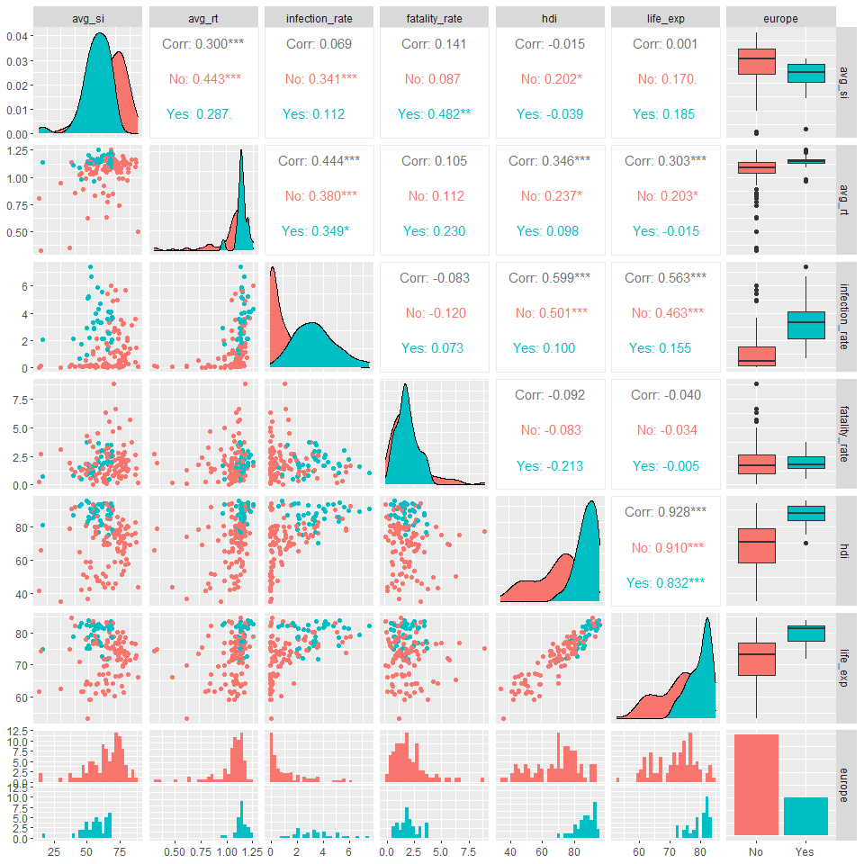

By seeing the **avg\_si** versus the other measures, It is clear there
is not an high correlation.

Now, I want to investigate differences in average of stringency index
between Europe and non-Europe countries, ignoring other variables at the
moment.

``` r
covid %>% ggplot() + geom_boxplot(mapping = aes(y = avg_si, x = europe), color = "blue", fill="blue", alpha=0.2) + labs(x = "Europe", y = "Avg Stringency Index")
```

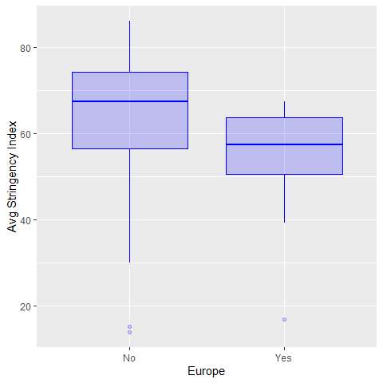

There aren’t sensible differences between Europe countries and
non-Europe countries.

## Fitting the model

After done the exploratory analysis, I fit the linear regression model
using the *ordinary least squares* estimation. The response variable is
the average value of stringency index, and the other variables are the
predictors.

``` r
ols = lm(avg_si ~ avg_rt + infection_rate + fatality_rate*europe + hdi + life_exp , data=covid)
(summ = summary(ols))
```

    ## 
    ## Call:
    ## lm(formula = avg_si ~ avg_rt + infection_rate + fatality_rate * 
    ##     europe + hdi + life_exp, data = covid)
    ## 
    ## Residuals:
    ##     Min      1Q  Median      3Q     Max 
    ## -39.673  -5.872   0.865   8.500  41.562 
    ## 
    ## Coefficients:
    ##                          Estimate Std. Error t value Pr(>|t|)    
    ## (Intercept)              23.47064   19.05633   1.232   0.2203    
    ## avg_rt                   30.60733    7.50806   4.077 7.97e-05 ***
    ## infection_rate            1.21693    0.75922   1.603   0.1114    
    ## fatality_rate             0.57536    0.77725   0.740   0.4605    
    ## europeYes               -23.32112    5.24026  -4.450 1.84e-05 ***
    ## hdi                       0.01737    0.18629   0.093   0.9258    
    ## life_exp                  0.07247    0.38561   0.188   0.8512    
    ## fatality_rate:europeYes   4.24464    2.29927   1.846   0.0672 .  
    ## ---
    ## Signif. codes:  0 '***' 0.001 '**' 0.01 '*' 0.05 '.' 0.1 ' ' 1
    ## 
    ## Residual standard error: 11.41 on 128 degrees of freedom
    ## Multiple R-squared:  0.2962, Adjusted R-squared:  0.2577 
    ## F-statistic: 7.695 on 7 and 128 DF,  p-value: 9.543e-08

Since there are non-significant variables, I make a variable selection.

## Variable selection

The aim is to remove irrelevant predictors by getting the best subset
model.

``` r
ols_bss = regsubsets(avg_si ~ avg_rt + infection_rate + fatality_rate*europe + hdi + life_exp , data=covid)
summ_bss = summary(ols_bss)
```

The **regsubsets()** function included in the *leaps* library performs
best subset selection by identifying the best model that contains a
given number of predictors, where best is quantified using RSS. An
asterisk indicates that a given variable is included in the
corresponding model.

For checking the best subset model, I compare the *BIC*, adjusted
*R*<sup>2</sup> and Mallow’s *Cp* and Cross-Validation error among them.

``` r
p <- 7
k <- 10
set.seed (1)
folds <- sample (1:k,nrow(covid),replace =TRUE)
cv.errors <- matrix (NA ,k, p, dimnames =list(NULL , paste (1:p) ))
for(j in 1:k){
    best.fit =regsubsets (avg_si ~ avg_rt + infection_rate + 
                            fatality_rate*europe + hdi + life_exp ,data=covid[folds!=j,])
    for(i in 1:p) {
        mat <- model.matrix(as.formula(best.fit$call[[2]]), covid[folds==j,])
        coefi <- coef(best.fit ,id = i)
        xvars <- names(coefi )
        pred <- mat[,xvars ]%*% coefi
        cv.errors[j,i] <- mean( (covid$avg_si[folds==j] - pred)^2)
    }
}
cv.mean <- colMeans(cv.errors)

# CV error
p1 = ggplot(mapping = aes(y = cv.mean,x = seq(1,p))) + geom_line()+
  geom_point() + geom_vline(xintercept = which.min(cv.mean), color = "red") + labs(title="CV error", y = "",x = "number of predictors")
# BIC
p2 = ggplot(mapping = aes(y = summ_bss$bic,x = seq(1,p))) + geom_line()+
  geom_point() + geom_vline(xintercept = which.min(summ_bss$bic), color = "red")+ labs(title="Drop in BIC", y = "",x = "number of predictors")
# Cp
p3 = ggplot(mapping = aes(y = summ_bss$cp,x = seq(1,p))) + geom_line()+
  geom_point()+ geom_vline(xintercept = which.min(summ_bss$cp), color = "red")+ labs(title="Mallow'Cp", y = "",x = "number of predictors")
#R2
p4 = ggplot(mapping = aes(y = summ_bss$adjr2,x = seq(1,p))) + geom_line()+
  geom_point()+ geom_vline(xintercept = which.max(summ_bss$adjr2), color = "red")+ labs(title="Adjusted R^2", y = "",x = "number of predictors")

grid.arrange(p1, p2,p3,p4, ncol = 4)
```

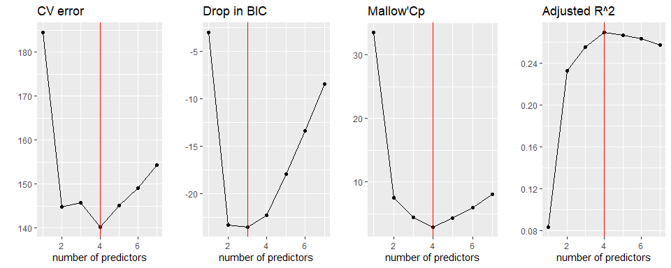<!-- -->

As shown by the graphs the best subset model is a model with 4
predictors: The CV error, Mallow’Cp and Adjusted *R*<sup>2</sup> get the
same result, only the BIC gets a different number of predictors.

``` r
ols1 = lm(avg_si ~ avg_rt + infection_rate + fatality_rate*europe, data=covid)
(summ1 = summary(ols1))
```

    ## 
    ## Call:
    ## lm(formula = avg_si ~ avg_rt + infection_rate + fatality_rate * 
    ##     europe, data = covid)
    ## 
    ## Residuals:
    ##     Min      1Q  Median      3Q     Max 
    ## -40.639  -5.895   0.609   8.381  41.080 
    ## 
    ## Coefficients:
    ##                         Estimate Std. Error t value Pr(>|t|)    
    ## (Intercept)              29.3529     7.4797   3.924  0.00014 ***
    ## avg_rt                   30.9431     7.3935   4.185 5.21e-05 ***
    ## infection_rate            1.3831     0.7000   1.976  0.05028 .  
    ## fatality_rate             0.5662     0.7662   0.739  0.46124    
    ## europeYes               -22.7715     5.0685  -4.493 1.54e-05 ***
    ## fatality_rate:europeYes   4.2011     2.2766   1.845  0.06726 .  
    ## ---
    ## Signif. codes:  0 '***' 0.001 '**' 0.01 '*' 0.05 '.' 0.1 ' ' 1
    ## 
    ## Residual standard error: 11.33 on 130 degrees of freedom
    ## Multiple R-squared:  0.2942, Adjusted R-squared:  0.2671 
    ## F-statistic: 10.84 on 5 and 130 DF,  p-value: 9.941e-09

## Collinearity

To detect collinearity issues, I use the *variance inflation factor
(VIF)*.

``` r
vif(ols1)
```

    ##                  avg_rt          infection_rate           fatality_rate 
    ##                1.283197                1.696744                1.164106 
    ##               europeYes fatality_rate:europeYes 
    ##                5.386908                5.205807

I think there is not collinearity issues among predictors. also because
the variance inflation factor is lower than 10 for each parameters
(considering there is an interaction as well).

## Diagnostics

The diagnostics analysis is important to improve a regression model by
observing some assumptions:

### Constant variance assumption

I plot residuals versus the fitted values.

``` r
ggplot(mapping = aes(y = residuals(ols1),x = fitted(ols1), color = covid$europe)) + geom_point()+ geom_hline(yintercept = 0, color = "red")+ labs(title="Residuals vs. Fitted values", y = "Residuals",x = "Fitted values")
```

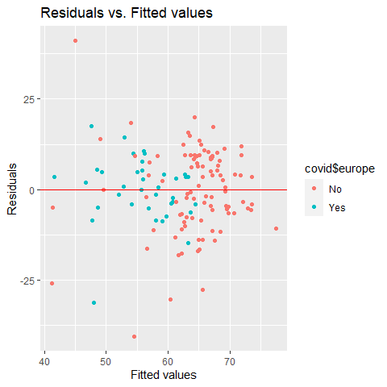

The graph show a no strong right opening megaphone, therefore a
non-constant variance.

### Structure of the relationship between the predictors and the response

``` r
residualPlots(ols1)
```

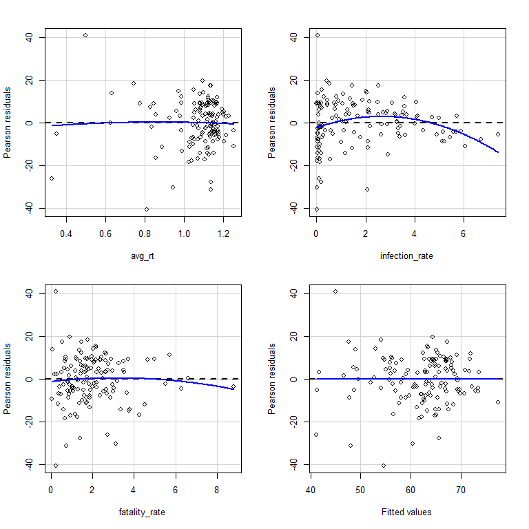

    ##                Test stat Pr(>|Test stat|)   
    ## avg_rt           -0.2773         0.781989   
    ## infection_rate   -2.9197         0.004136 **
    ## fatality_rate    -0.6636         0.508111   
    ## Tukey test       -0.0163         0.987024   
    ## ---
    ## Signif. codes:  0 '***' 0.001 '**' 0.01 '*' 0.05 '.' 0.1 ' ' 1

Since the p-value associated to **infection\_rate** is very low we have
to transform it.

### Normality Assumption

I use the Q-Q plot to investigate the normality assumption.

``` r
ggplot(mapping = aes(sample = residuals(ols1))) + stat_qq() + stat_qq_line() + labs(title = "QQ-plot", y = "Residuals", x = "Theoretical Quantiles")
```

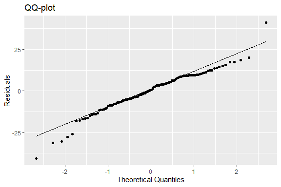

I can check this computing also Shapiro-Wilk normality test:

``` r
shapiro.test(residuals(ols1))
```

    ## 
    ##  Shapiro-Wilk normality test
    ## 
    ## data:  residuals(ols1)
    ## W = 0.96082, p-value = 0.0006132

The null hypothesis is residuals are normal. Since the p-value is small,
I reject *H*<sub>0</sub>.

### Leverage points

I compute the high leverage points:

``` r
hat = hatvalues(ols1)
hat[which(hat>=(2*sum(hat)/nrow(covid)))]
```

    ##          United States                  Italy                 Mexico 
    ##             0.08948721             0.11684859             0.21661074 
    ##                Ecuador               Bulgaria                 Greece 
    ##             0.10416697             0.14591960             0.13011559 
    ## Bosnia and Herzegovina             Luxembourg                  Sudan 
    ##             0.13226726             0.11836202             0.09230637 
    ##                 Cyprus              Nicaragua                Iceland 
    ##             0.09892152             0.21765065             0.11160198 
    ##                Eritrea              Mauritius 
    ##             0.12734479             0.19541037

An high leverage point has a value greater than 2(*p* + 1)/*n*. There
are 14 high-leverage points. In the half-normal I am looking for points
that diverge substantially from the rest of the data.

``` r
halfnorm(hat, 14, labs = rownames(covid), ylab="Leverages")
```

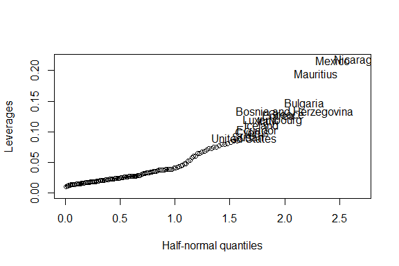

### Outliers

I compute standardized residuals and plot them to find possible
outliers.

``` r
rsta = rstandard(ols1)
ggplot(mapping = aes(x = fitted(ols1), y = rsta, color=covid$europe)) + geom_point() + labs(title = "Standardize residuals vs. Fitted values", y = "Standardize Residuals", x = "Fitted values") + geom_hline(yintercept = c(-3,0, 3), color = c("green","red","green")) 
```

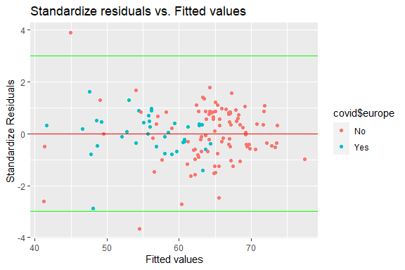
It is possible to see there are two outliers points
(*r*<sub>*i*</sub> &gt; \|3\|).

### Influential Points

I plot standardized residuals versus the leverages to find the
influential points:

``` r
ggplot(mapping = aes(x = hat, y = rsta)) + geom_point() + labs(title = "Standardize residuals vs. Leverage", y = "Standardize Residuals", x = "Leverage") + geom_text(mapping = aes(hat[hat>0.088], rsta[hat>0.088], label = rownames(covid)[hat>0.088]))
```

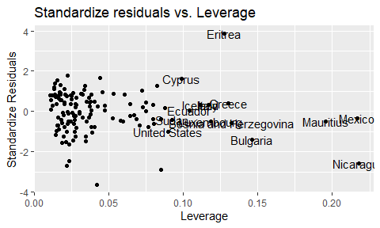

I calculate the Cook’s distance by fit R function:

``` r
cook <- cooks.distance(ols1)
tail(sort(cook))
```

    ##     Cyprus   Bulgaria    Burundi    Belarus  Nicaragua    Eritrea 
    ## 0.04818186 0.05705373 0.09734644 0.12833897 0.31335291 0.36616439

## Improvment of my model

To improve my model first of all I transform the fatality rate and the
infection rate using the logarithmic function. Then I remove the biggest
influential point computed by Cook’s distance.

``` r
ols2 = lm(avg_si ~ avg_rt + log(infection_rate) + log(fatality_rate)*europe,
          data=covid, subset = (cook < max(cook)))
par(mfrow=c(2,2))
plot(ols2)
```

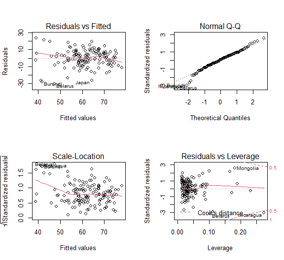

## Analysis of estimate parameters

``` r
(summ2 = summary(ols2))$coefficients
```

    ##                                Estimate Std. Error   t value     Pr(>|t|)
    ## (Intercept)                   36.736895  8.2705658  4.441884 1.897587e-05
    ## avg_rt                        27.798136  7.5634640  3.675318 3.471304e-04
    ## log(infection_rate)            2.852313  0.6579723  4.335005 2.909126e-05
    ## log(fatality_rate)             2.338316  1.1910552  1.963231 5.177076e-02
    ## europeYes                    -20.337057  2.8727564 -7.079284 8.318671e-11
    ## log(fatality_rate):europeYes   6.054411  3.4415671  1.759202 8.091411e-02

To show graphically the relationship between the response and
predictors, I plot the following graphs.

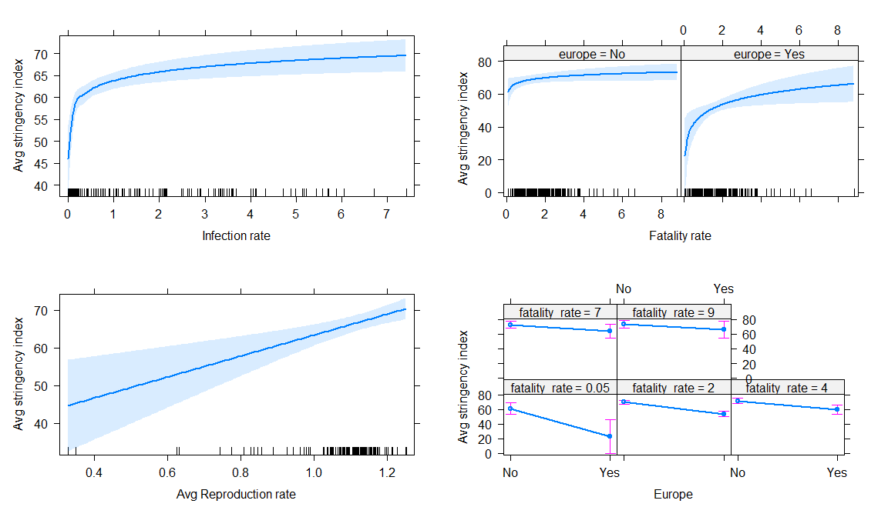

The response increase faster in countries with a smaller infection rate
, there is relatively little change in countries with an infection rate
more bigger. An increment of one unit of *l**o**g*(*x*<sub>2</sub>)
determine an increment of *ŷ* equal to *β̂*<sub>2</sub> points

About the fatality rate, there are two graphs because of the interaction
with the **europe** dummy variable:

-   *Europe = “No” (*x*<sub>4</sub> = 0)*: An increment of one unit of
    *l**o**g*(*x*<sub>3</sub>) determine an increment of *ŷ* equal to
    *β̂*<sub>3</sub> points;
-   *Europe = “Yes” (*x*<sub>4</sub> = 1)*: In this case there is a less
    fast increment. *β̂*<sub>0</sub> became 16.393
    (*β̂*<sub>0</sub> + *β̂*<sub>4</sub>) and an increment of
    *l**o**g*(*x*<sub>3</sub>) determine an increment of *ŷ* equal to
    (*β̂*<sub>3</sub> + *β̂*<sub>5</sub>).

The response increase in constant way by an increment of the
reproduction rate. An increment of one unit of *x*<sub>1</sub> determine
a increment of *ŷ* equal to *β̂*<sub>1</sub> points.

The *β̂*<sub>0</sub> is a value of *ŷ* when all predictor are equal to 0.

Now I compute confidence intervals to check the uncertain of my
coefficients.

``` r
x = cbind(summ2$coefficients[,1],confint(ols2)); x
```

    ##                                                2.5 %     97.5 %
    ## (Intercept)                   36.736895  20.37337846  53.100412
    ## avg_rt                        27.798136  12.83363755  42.762635
    ## log(infection_rate)            2.852313   1.55049864   4.154127
    ## log(fatality_rate)             2.338316  -0.01821592   4.694848
    ## europeYes                    -20.337057 -26.02087630 -14.653239
    ## log(fatality_rate):europeYes   6.054411  -0.75481336  12.863636

As shown by the table, the uncertain of my parameters is relatively high
in the whole.

## *σ̂* and *R*<sup>2</sup>

The *σ̂* explains the uncertain of the fitted values, The value is high:

``` r
summ2$sigma
```

    ## [1] 10.07453

The *R*<sup>2</sup> has a medium value. The same happens for adjusted
*R*<sup>2</sup>.

``` r
#R^2
cat("R^2    :",summ$adj.r.squared,"\n")
```

    ## R^2    : 0.2576852

``` r
#adj R^2
cat("adj R^2:",summ$r.squared)
```

    ## adj R^2: 0.2961756

The coefficient of determination represents the proportional reduction
of total variation associated with the use of the predictor variables X.
Therefore, about 43% of the observed average of stringency index
variability is explained by predictors.

## Inferences about regression coefficients

### testing all *β*<sub>*j*</sub> coefficients

We consider a test concerning *β*<sub>1</sub>, the coefficient for the
regressor **avg\_rt**.

I am testing the effect of adding **avg\_rt** to a mean function that
already includes all other regressors.

``` r
# Z-score
z = summ2$coefficients[2,3]
# p-value
p_value = summ2$coefficients[2,4]
```

    ##       z-score      p-value
    ## [1,] 3.675318 0.0003471304

The results provide some evidence that the effect of **avg\_rt** on
closure level, after adjusting for the other predictors, is different
from 0. I can make the same test to all coefficients, but the result is
already given by **summary()** function:

    ##                                t value     Pr(>|t|)
    ## (Intercept)                   4.441884 1.897587e-05
    ## avg_rt                        3.675318 3.471304e-04
    ## log(infection_rate)           4.335005 2.909126e-05
    ## log(fatality_rate)            1.963231 5.177076e-02
    ## europeYes                    -7.079284 8.318671e-11
    ## log(fatality_rate):europeYes  1.759202 8.091411e-02

there are evidence against the null hypothesis for all predictors, hence
they cannot be equal to 0.

### testing a group of regressor

I test the hypothesis that both **fatality\_rate** and the interaction
term may be excluded from the model because these have a p-value higher
than others predictors.

I can compute this using the **anova()** function.

``` r
ols0 = lm(avg_si ~ avg_rt + log(infection_rate) + europe,
          data=covid, subset = (cook < max(cook)))
anova(ols0,ols2)
```

    ## Analysis of Variance Table
    ## 
    ## Model 1: avg_si ~ avg_rt + log(infection_rate) + europe
    ## Model 2: avg_si ~ avg_rt + log(infection_rate) + log(fatality_rate) * 
    ##     europe
    ##   Res.Df   RSS Df Sum of Sq      F   Pr(>F)   
    ## 1    131 14159                                
    ## 2    129 13093  2      1066 5.2515 0.006418 **
    ## ---
    ## Signif. codes:  0 '***' 0.001 '**' 0.01 '*' 0.05 '.' 0.1 ' ' 1

There is evidence against the null hypothesis and the pair of predictor
are significant within my model.

## Prediction

Suppose I have the following information about a “new” country (suppose
that it exist): *avg\_rt=1.07, infection\_rate=1.77,
fatality\_rate=1.99, europe=“Yes”*. We obtain a prediction and 95%
prediction interval for a such country as:

``` r
newdata = data.frame(avg_rt=1.07, infection_rate=1.77,fatality_rate=1.99, europe="Yes" )
(p = predict(ols2, newdata = newdata, interval="prediction",level=.95))
```

    ##        fit     lwr      upr
    ## 1 53.54778 33.3016 73.79397
